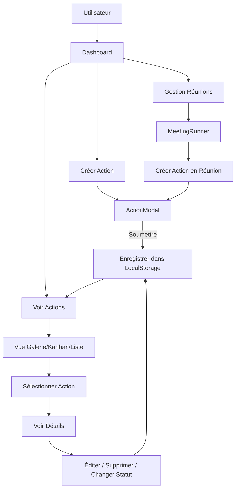

# VISI-DMS - Plan d'Amélioration de la Gestion des Actions

## Contexte
L'utilisateur souhaite améliorer la gestion des actions dans l'application VISI-DMS pour permettre une gestion efficace et complète de la création, édition, suppression de tous les éléments des actions.

## Analyse du Code Existant

### Types Actuels (types.ts)
```typescript
export interface ActionItem {
  id: string;
  description: string;
  status: ActionStatus;
  assigneeId: string;
  dueDate: string;
  priority: 'HIGH' | 'MEDIUM' | 'LOW';
  createdAt: string;
  meetingId?: string;
  area: string;
  department: string;
  proofImage?: string;  // Une seule image
}
```

### Composants Principaux
1. **MeetingRunner.tsx** - Gestion des réunions et création rapide d'actions
2. **ActionTracker.tsx** - Suivi des actions avec vues Galerie/Kanban/Liste
3. **SettingsPanel.tsx** - Paramètres et gestion des équipes

---

## Plan d'Amélioration

### 1. Amélioration du Type ActionItem
**Objectif** : Ajouter des champs pour une gestion plus complète

```typescript
export interface Attachment {
  id: string;
  name: string;
  type: 'image' | 'document' | 'pdf';
  url: string;  // base64 ou URL
  uploadedAt: string;
  size: number;
}

export interface Comment {
  id: string;
  userId: string;
  text: string;
  createdAt: string;
}

export interface ActionItem {
  id: string;
  description: string;
  status: ActionStatus;
  assigneeId: string;
  dueDate: string;
  priority: 'HIGH' | 'MEDIUM' | 'LOW';
  createdAt: string;
  updatedAt: string;
  meetingId?: string;
  area: string;
  department: string;
  category?: string;      // Type d'action (Sécurité, Qualité, Maintenance...)
  location?: string;       // Localisation détaillée
  tags?: string[];         // Tags pour filtrage
  attachments: Attachment[];  // Multiple fichiers/photos
  comments: Comment[];    // Commentaires
  completedAt?: string;   // Date de completion
  verifiedBy?: string;    // Qui a vérifié
}
```

### 2. Création du Composant ActionModal
**Objectif** : Modal réutilisable pour création et édition d'actions

Fonctionnalités :
- Tous les champs modifiables
- Upload multi-photos avec aperçu
- Upload de documents (PDF, Word, Excel)
- Sélecteur de date avec calendrier
- Sélection de responsable dynamique (depuis les équipes)
- Sélection de priorité et département
- Zone de tags avec autocomplétion
- Section commentaires
- Historique des modifications

### 3. Amélioration de MeetingRunner
**Objectif** : Remplacer la création rapide par un modal complet

- Ajouter un bouton "Créer une action" qui ouvre le ActionModal
- Conserver les actions crées pendant la réunion dans une barre latérale
- Permettre l'édition et suppression des actions avant validation finale

### 4. Amélioration de ActionTracker
**Objectif** : CRUD complet pour les actions

- **Create** : Bouton principal pour créer nouvelle action
- **Read** : Vue détaillée avec toutes les infos et pièces jointes
- **Update** : Édition via ActionModal
- **Delete** : Confirmation avant suppression

Nouvelles fonctionnalités :
- Filtres avancés (par date, responsable, priorité, département, tags)
- Recherche textuelle
- Tri multi-col des actionsonnes
- Export (PDF, Excel)
- Bulk actions (modifier statut de plusieurs actions)

### 5. Support Multi-Photos et Documents
**Objectif** : Gérer les pièces jointes efficacement

- Upload par glisser-déposer
- Aperçu des images
- Téléchargement des documents
- Limitation de taille (max 5MB par fichier)
- Compression automatique des images

### 6. Amélioration de la Gestion des Équipes
**Objectif** : Système plus flexible

- CRUD complet des équipes
- Ajout/suppression de membres
- Rôles des membres dans l'équipe
- Attribution des actions par équipe ou par membre

### 7. Configuration Déploiement Vercel
**Objectif** : Assurer un déploiement sans erreur

Problèmes identifiés :
- `vercel.json` utilise `routes` au lieu de `rewrites`
- Configuration trop complexe pour un SPA

Solution proposée :
```json
{
  "buildCommand": "npm run build",
  "outputDirectory": "dist",
  "framework": "vite",
  "rewrites": [
    { "source": "/(.*)", "destination": "/index.html" }
  ]
}
```

---

## Ordre de Priorité

1. **Phase 1** : Améliorer types.ts et créer ActionModal (Fondamental)
2. **Phase 2** : Améliorer ActionTracker avec CRUD complet
3. **Phase 3** : Améliorer MeetingRunner avec modal
4. **Phase 4** : Support multi-pièces jointes
5. **Phase 5** : Améliorer gestion des équipes
6. **Phase 6** : Configurer correctement Vercel

---

## Diagramme de Flux - Gestion des Actions



---

## Fichiers à Modifier

| Fichier | Action |
|---------|--------|
| `types.ts` | Ajouter nouveaux types |
| `constants.ts` | Ajouter catégories/tags par défaut |
| `components/ActionModal.tsx` | **NOUVEAU** - Modal réutilisable |
| `components/ActionTracker.tsx` | Améliorer CRUD complet |
| `components/MeetingRunner.tsx` | Intégrer ActionModal |
| `components/SettingsPanel.tsx` | Améliorer gestion équipes |
| `App.tsx` | Ajouter nouvelles fonctions de gestion |
| `vercel.json` | Corriger configuration |

---

## Notes Techniques

- Utiliser `crypto.randomUUID()` pour les IDs uniques
- Stocker les pièces jointes en base64 (avec compression)
- Limiter le nombre de pièces jointes (max 10 par action)
- Implémenter une validation des formulaires
- Ajouter des animations pour une meilleure UX
